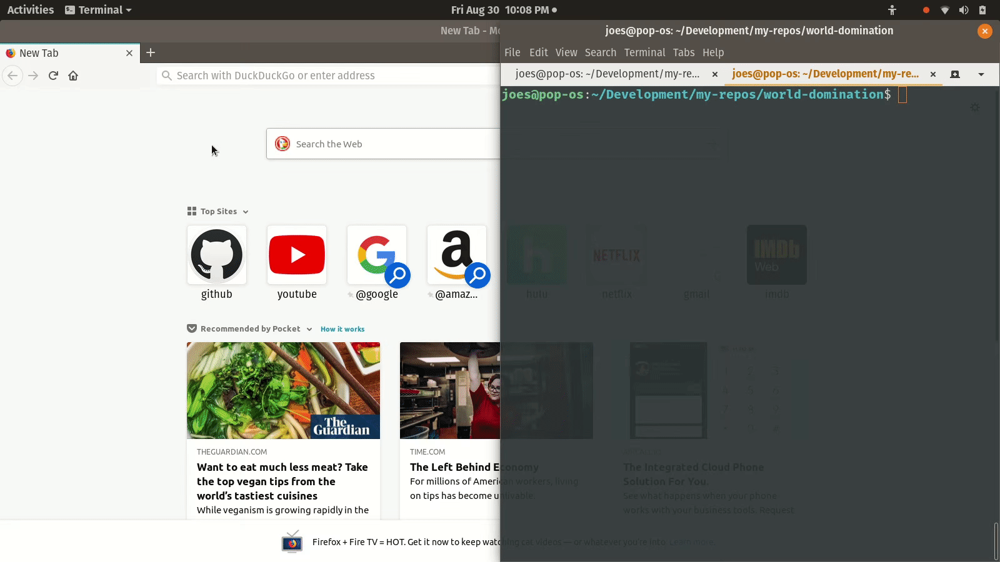
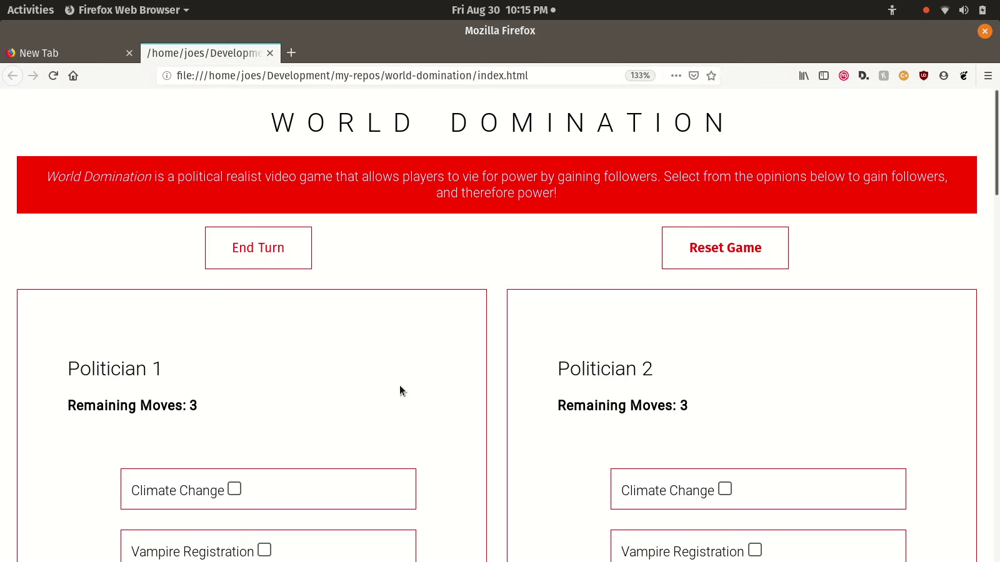
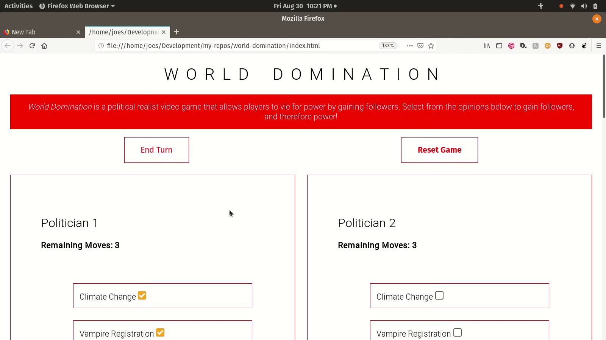
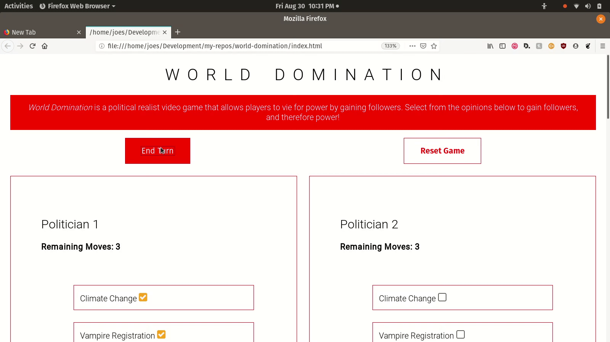

# WORLD DOMINATION

*World Domination* is a political realist video game that allows players to vie for power by gaining followers. It uses a Rails backend to seed associations between topics and followers. Users gain followers by selecting topics associated with those followers. Javascript written in the functional paradigm tracks game logic the DOM on user interaction.

## How to Play

* Every player gets three moves per turn, and there are four turns. Before beginning, select your player -- `Politician 1`, `Politician 2`, or `Politician 3`.
* For the first turn, select three issues from those provided in your player section that you sympathize with most.

* Click `End Turn` at the top of the screen when all players have selected their three most important issues. Then, read the `Power Ranking` section to see how many followers you gained by sharing an issue of concern with them.
* Observe which player has the most power (quantity of followers) and note the issues they chose to gain that power.

* For the subsequent turns, add more issues that you *sympathize* with based on the power that you believe it gained your opponents.
* The player with the most power, that is followers, by the end of four turns wins.

* Click `Reset Game` at the top of the screen to play again!
* *BAH HAHAHAHAHAHAHA!!!*

## Some bugs

* There are more moves per player than topics, so every player can select every topic, ending in a three-way draw. The demo above shows ending the game early by clicking the `End Turn` button before players added additional moves, thus allowing for a player to actually win the game.
* In the case of a three-way draw, a two-way draw between `Politician 1` and `Politician 2` is called.
* If a player accidentally clicks a topic they've already selected, it counts as a move.
* The interface requires scrolling up and down in order to keep track of game updates, making for an awkward gaming experience that virtually counteracts the power of Javascript to update the DOM.
* Resetting the game does not reset or update the message declaring who won the previous game.

#### Developed over the course of about five days by Joe Jamsky and Joseph Syverson
